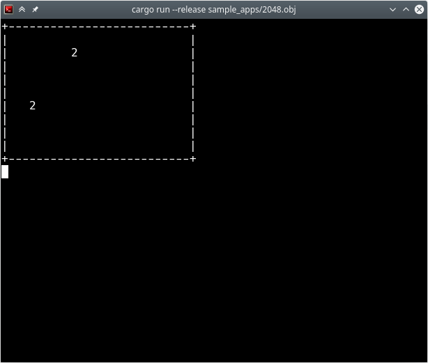
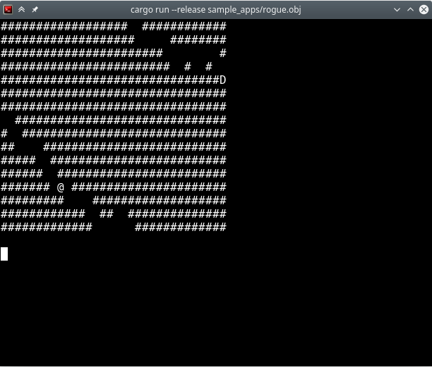

# lc3-vm-rust

This is a **highly experimental** implementation of [LC-3](https://en.wikipedia.org/wiki/LC-3) virtual machine in Rust. To get it to a working state quickly, I wrote it by converting the reference C code to Rust almost line by line. I will do further modifications and refactorization along the way while I improve my programming and Rust skills.

Currently two sample apps 2048 and Rouge are working(barely):





# How to run

To build, install ```rustup```, then execute:
```
$ git clone https://github.com/erfur/lc3-vm-rust
$ cd lc3-vm-rust
$ cargo build --release
```

To run rogue app:
```
$ cargo run --release sample_apps/rogue.obj
```

# References

The reference C code was taken from this project: 

https://justinmeiners.github.io/lc3-vm/index.html